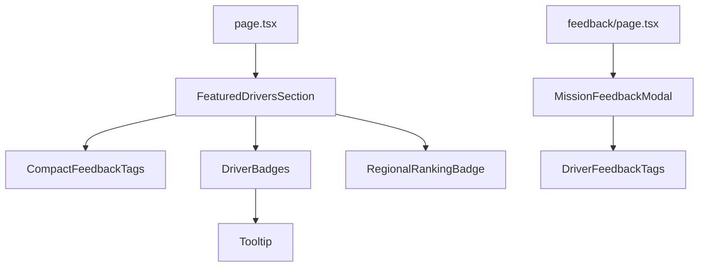

# Liste des fichiers - Phase UI Feedback & Badges

## Fichiers créés

### Composants React

1. **`/src/components/driver-feedback-tags.tsx`**
   - DriverFeedbackTags : Sélection interactive des tags
   - CompactFeedbackTags : Affichage compact des top tags
   - feedbackTags : Configuration des 10 tags avec emojis

2. **`/src/components/driver-badges.tsx`**
   - DriverBadges : Affichage des badges avec tooltips
   - RegionalRankingBadge : Badge de classement régional
   - badgeConfig : Configuration des 10 badges

3. **`/src/components/mission-feedback-modal.tsx`**
   - MissionFeedbackModal : Modal complète de notation post-mission
   - Gestion du rating par étoiles
   - Intégration des tags
   - Champ commentaire optionnel

4. **`/src/components/featured-drivers-section.tsx`**
   - FeaturedDriversSection : Section client pour l'affichage des chauffeurs
   - Intègre CompactFeedbackTags, DriverBadges, RegionalRankingBadge
   - Compatible SSR

5. **`/src/components/ui/tooltip.tsx`**
   - Composant Tooltip de Radix UI
   - Utilisé pour les tooltips des badges

### Pages

6. **`/src/app/jobs/[id]/feedback/page.tsx`**
   - Page de notation post-mission
   - Affiche infos mission et chauffeur
   - Utilise MissionFeedbackModal
   - Écran de confirmation

### Documentation

7. **`/PHASE_UI_FEEDBACK_BADGES.md`**
   - Documentation technique complète
   - Architecture et composants
   - Exemples de code

8. **`/GUIDE_UTILISATION_FEEDBACK.md`**
   - Guide utilisateur détaillé
   - Maquettes textuelles des interfaces
   - Flux de notation complet
   - Exemples de données

9. **`/REFERENCE_RAPIDE_FEEDBACK.md`**
   - Référence rapide développeur
   - APIs des composants
   - Types TypeScript
   - Exemples d'intégration

10. **`/FICHIERS_MODIFIES_UI_FEEDBACK.md`**
    - Ce fichier
    - Liste exhaustive des modifications

---

## Fichiers modifiés

### 1. `/src/app/page.tsx`

**Lignes modifiées :** ~20 lignes

**Imports ajoutés :**
```typescript
import { type FeedbackTag } from "@/components/driver-feedback-tags"
import { type BadgeType } from "@/components/driver-badges"
import { FeaturedDriversSection } from "@/components/featured-drivers-section"
```

**Données enrichies :**
```typescript
const featuredDrivers = [
  {
    // ... champs existants
    topTags: [
      { tag: "PUNCTUAL" as FeedbackTag, percentage: 89 },
      { tag: "CAREFUL" as FeedbackTag, percentage: 85 },
      { tag: "PROFESSIONAL" as FeedbackTag, percentage: 82 },
    ],
    badges: ["PUNCTUALITY_CHAMPION", "FIRST_100_DELIVERIES", "TOP_3_REGION"] as BadgeType[],
    regionalRanking: { position: 3, region: "Paris" },
  },
  // ... 3 autres chauffeurs avec données similaires
]
```

**Section remplacée :**
```typescript
// Avant : Section inline de ~150 lignes avec tous les composants
{/* Chauffeurs disponibles - Style Airbnb */}
<section className="py-16 px-4 bg-muted/30">
  <div className="container mx-auto">
    {/* ... beaucoup de JSX ... */}
  </div>
</section>

// Après : Composant client dédié
<FeaturedDriversSection drivers={featuredDrivers} />
```

**Supprimé :**
```typescript
// Constantes déplacées dans FeaturedDriversSection
const availabilityLabels: Record<string, { label: string; color: string }>
const vehicleTypeLabels: Record<string, string>
```

---

### 2. `/src/lib/types/driver-feedback.ts`

**Lignes modifiées :** ~10 lignes

**Ajouts dans TAG_DESCRIPTIONS :**
```typescript
export const TAG_DESCRIPTIONS: Record<FeedbackTag, string> = {
  PUNCTUAL: "Ponctuel",
  CAREFUL: "Soigneux",
  COMMUNICATIVE: "Bonne communication",
  FAST: "Rapide",
  PRECISE: "Précis",
  // ✅ Nouveaux
  FRIENDLY: "Souriant",
  RESOURCEFUL: "Débrouillard",
  RESPONSIVE: "Réactif",
  PROFESSIONAL: "Professionnel",
  RELIABLE: "Fiable",
}
```

---

### 3. `package.json`

**Dépendance ajoutée :**
```json
{
  "dependencies": {
    // ... autres dépendances
    "@radix-ui/react-tooltip": "^1.x.x"
  }
}
```

---

## Statistiques

### Fichiers créés
- **Composants React :** 5 fichiers
- **Pages :** 1 fichier
- **Documentation :** 4 fichiers
- **Total :** 10 fichiers

### Fichiers modifiés
- **Pages :** 1 fichier (page.tsx)
- **Types :** 1 fichier (driver-feedback.ts)
- **Config :** 1 fichier (package.json)
- **Total :** 3 fichiers

### Lignes de code
- **Composants React :** ~800 lignes
- **Pages :** ~150 lignes
- **Documentation :** ~2000 lignes
- **Total nouveau code :** ~950 lignes
- **Total documentation :** ~2000 lignes

---

## Arborescence des fichiers créés

```
prestapop/
├── src/
│   ├── app/
│   │   ├── page.tsx                              [MODIFIÉ]
│   │   └── jobs/
│   │       └── [id]/
│   │           └── feedback/
│   │               └── page.tsx                  [CRÉÉ]
│   ├── components/
│   │   ├── driver-badges.tsx                     [CRÉÉ]
│   │   ├── driver-feedback-tags.tsx              [CRÉÉ]
│   │   ├── featured-drivers-section.tsx          [CRÉÉ]
│   │   ├── mission-feedback-modal.tsx            [CRÉÉ]
│   │   └── ui/
│   │       └── tooltip.tsx                       [CRÉÉ]
│   └── lib/
│       └── types/
│           └── driver-feedback.ts                [MODIFIÉ]
├── package.json                                   [MODIFIÉ]
├── PHASE_UI_FEEDBACK_BADGES.md                   [CRÉÉ]
├── GUIDE_UTILISATION_FEEDBACK.md                 [CRÉÉ]
├── REFERENCE_RAPIDE_FEEDBACK.md                  [CRÉÉ]
└── FICHIERS_MODIFIES_UI_FEEDBACK.md              [CRÉÉ]
```

---

## Composants par type

### Composants Client ("use client")
- `driver-badges.tsx`
- `driver-feedback-tags.tsx`
- `featured-drivers-section.tsx`
- `mission-feedback-modal.tsx`
- `tooltip.tsx`

### Pages
- `jobs/[id]/feedback/page.tsx` (client)
- `page.tsx` (server, utilise composants client)

---

## Imports inter-composants



---

## Dépendances externes

### Packages npm
- `@radix-ui/react-tooltip` (nouveau)
- `lucide-react` (existant)
- `next` (existant)
- `react` (existant)

### Composants shadcn/ui utilisés
- `Badge`
- `Button`
- `Card`
- `Avatar`
- `Textarea`

---

## Routes créées

### Nouvelles routes
1. `/jobs/[id]/feedback` - Page de notation post-mission

### Routes utilisant les nouveaux composants
1. `/` (page d'accueil - vue entreprise)

---

## Types exportés

### driver-feedback-tags.tsx
```typescript
export type FeedbackTag
export interface FeedbackTagConfig
export const feedbackTags: FeedbackTagConfig[]
export function DriverFeedbackTags(props)
export function CompactFeedbackTags(props)
```

### driver-badges.tsx
```typescript
export type BadgeType
export interface BadgeConfig
export const badgeConfig: Record<BadgeType, BadgeConfig>
export function DriverBadges(props)
export function RegionalRankingBadge(props)
```

### mission-feedback-modal.tsx
```typescript
export interface MissionFeedback
export function MissionFeedbackModal(props)
```

### featured-drivers-section.tsx
```typescript
interface Driver (non exporté)
export function FeaturedDriversSection(props)
```

---

## Changements de build

### Avant
```bash
Route (app)                              Size  First Load JS
├ ƒ /                                   5.2 kB         135 kB
```

### Après
```bash
Route (app)                              Size  First Load JS
├ ƒ /                                  22.2 kB         135 kB  (+17 kB)
├ ƒ /jobs/[id]/feedback                7.2 kB         117 kB  (nouveau)
```

**Impact :** +17 kB sur la page d'accueil (composants feedback/badges)

---

## Checklist de vérification

### Build
- [x] `npm run build` réussit
- [x] Aucune erreur TypeScript
- [x] Warnings mineurs uniquement (variables non utilisées)

### Composants
- [x] Tous les composants compilent
- [x] Types correctement définis
- [x] Imports/exports cohérents

### Pages
- [x] Page d'accueil enrichie avec feedback/badges
- [x] Page de feedback post-mission fonctionnelle

### Documentation
- [x] Documentation technique complète
- [x] Guide utilisateur détaillé
- [x] Référence rapide développeur
- [x] Liste des fichiers

### Tests manuels recommandés
- [ ] Page d'accueil affiche correctement les chauffeurs avec tags/badges
- [ ] Tooltips des badges fonctionnent
- [ ] Page de feedback permet la sélection des tags
- [ ] Validation du formulaire de feedback fonctionne
- [ ] Écran de confirmation s'affiche après soumission

---

## Commandes pour vérifier

```bash
# Vérifier le build
npm run build

# Vérifier le lint
npm run lint

# Lancer en dev
npm run dev

# Vérifier les types
npx tsc --noEmit
```

---

## Notes de migration

Si vous avez une version existante de l'app :

1. **Sauvegarder** `/src/app/page.tsx` avant modification
2. **Installer** `@radix-ui/react-tooltip`
3. **Copier** les 5 nouveaux composants
4. **Créer** la page `/jobs/[id]/feedback`
5. **Mettre à jour** `/src/app/page.tsx` avec les nouvelles données
6. **Tester** le build

---

## Contacts et support

Pour questions ou problèmes :
- Voir documentation technique : `PHASE_UI_FEEDBACK_BADGES.md`
- Voir guide utilisateur : `GUIDE_UTILISATION_FEEDBACK.md`
- Voir référence rapide : `REFERENCE_RAPIDE_FEEDBACK.md`
- Code source : `/src/components/*.tsx`
